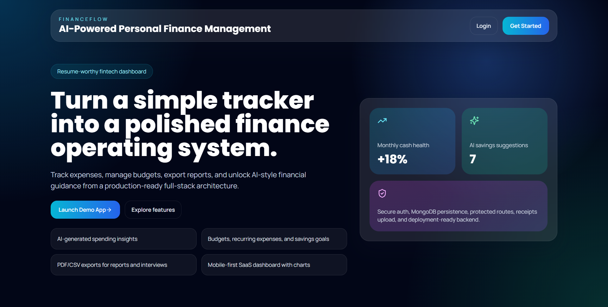
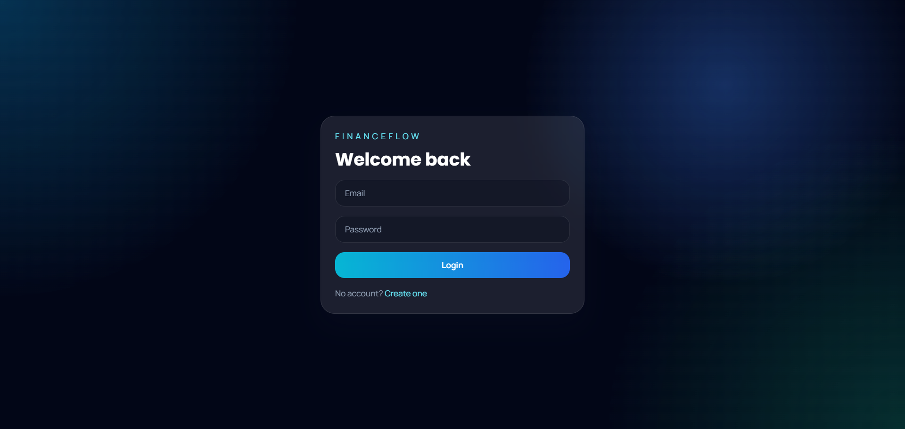
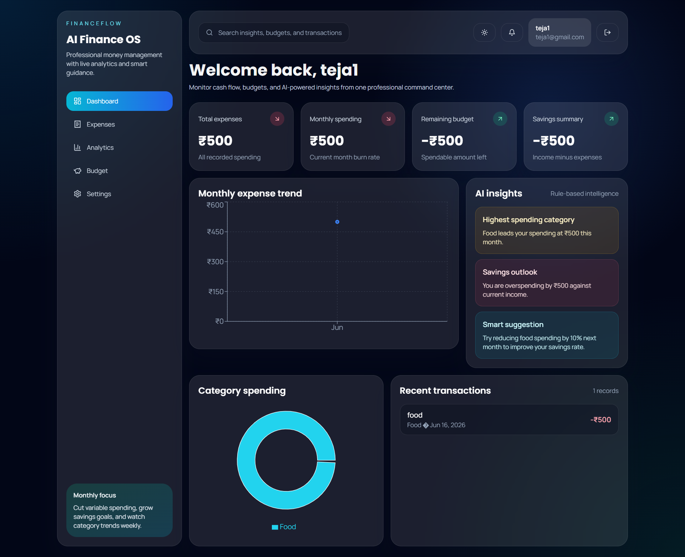
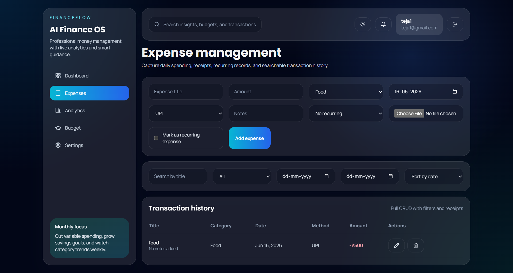
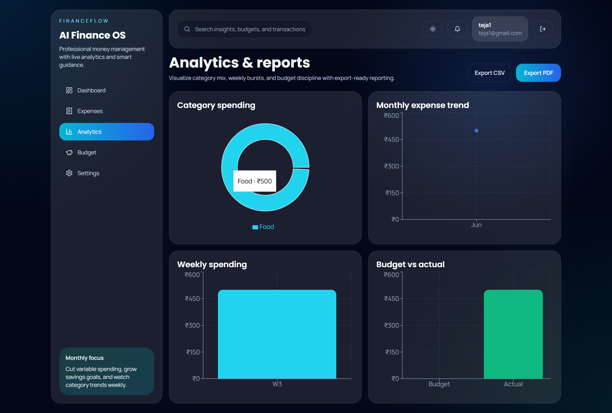
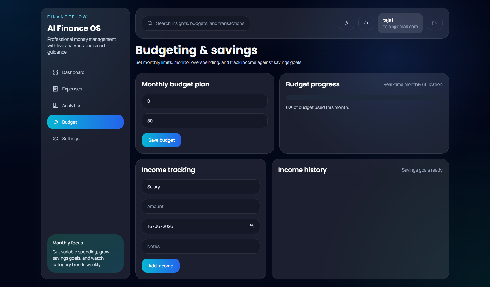

# 💰 FinanceFlow

FinanceFlow is a full-stack personal finance management platform designed to help users track expenses, manage budgets, analyze spending habits, and gain financial insights through interactive dashboards.

## 🌐 Live Demo

🔗 Frontend: https://financeflow-mauve.vercel.app

🔗 Backend API: https://financeflow-backend-l0vt.onrender.com

---


## 📸 Screenshots

### Landing Page



### Login Page



### Dashboard



### Expense Management



### Analytics & Reports



### Budget Management



---

## 🚀 Features

### 🔐 Authentication & Security

* JWT Authentication
* Protected Routes
* Secure Password Encryption
* User Authorization

### 💵 Expense Management

* Add, Edit, Delete Expenses
* Expense Categorization
* Expense History Tracking
* Smart Filtering & Search

### 📊 Budget Management

* Budget Planning
* Spending Monitoring
* Budget Performance Tracking
* Monthly Budget Analysis

### 📈 Financial Analytics

* Expense Insights
* Spending Trends
* Category-wise Analysis
* Interactive Charts & Dashboards

### 👤 Profile Management

* User Profile Settings
* Personal Finance Preferences
* Account Management

### 📱 Mobile App Support

* Capacitor Integration
* Android Studio Project
* Mobile-ready Architecture
* Android APK Generation Support

### ☁️ Cloud Deployment

* Frontend deployed on Vercel
* Backend deployed on Render
* MongoDB Atlas Database

---

## 🛠️ Tech Stack

### Frontend

* React.js
* Vite
* Tailwind CSS
* Recharts
* Framer Motion
* Axios

### Backend

* Node.js
* Express.js
* MongoDB Atlas
* Mongoose
* JWT Authentication
* bcrypt.js

### Mobile

* Capacitor
* Android Studio

### Deployment

* Vercel
* Render
* MongoDB Atlas

---

## 📂 Project Structure

```bash
FinanceFlow
│
├── backend/
│   ├── config/
│   ├── controllers/
│   ├── middleware/
│   ├── models/
│   ├── routes/
│   ├── utils/
│   └── server.js
│
├── frontend/
│   ├── src/
│   ├── public/
│   ├── android/
│   └── package.json
│
├── app.js
├── index.html
├── style.css
├── run-app.bat
└── README.md
```

---

## ⚙️ Local Setup

### Clone Repository

```bash
git clone https://github.com/Tejachaganti/financeflow-backend.git
```

### Backend

```bash
cd backend
npm install
npm run dev
```

### Frontend

```bash
cd frontend
npm install
npm run dev
```

### Quick Launch

```bash
run-app.bat
```

---

## 🔑 Environment Variables

### Backend (.env)

```env
PORT=5000
MONGODB_URI=your_mongodb_connection_string
JWT_SECRET=your_jwt_secret
CLIENT_URL=http://localhost:5173
```

### Frontend (.env)

```env
VITE_API_URL=https://financeflow-backend-l0vt.onrender.com/api
```

---

## 📌 Future Enhancements

* AI-powered Financial Insights
* Savings Goal Tracking
* Investment Tracking
* Recurring Expense Predictions
* Financial Health Score
* Smart Budget Recommendations

---

## 👨‍💻 Author

**Teja Chaganti**

GitHub: https://github.com/Tejachaganti

Portfolio: https://tejachaganti.github.io/portfolio/

LinkedIn: https://www.linkedin.com/in/chaganti-naga-veera-satya-teja-74b3b7327

---

⭐ Built as a Full-Stack Personal Finance Management Platform using React, Node.js, Express.js, MongoDB Atlas, JWT Authentication, Vercel, Render, and Android Studio.
